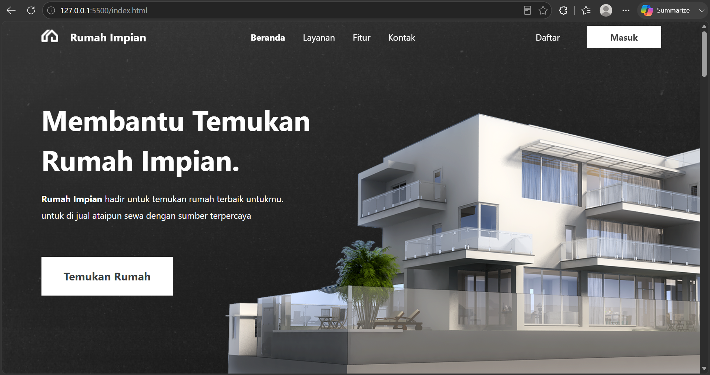
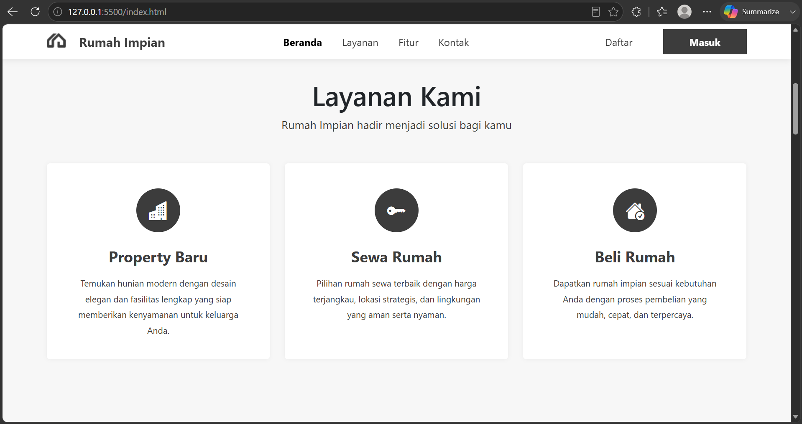
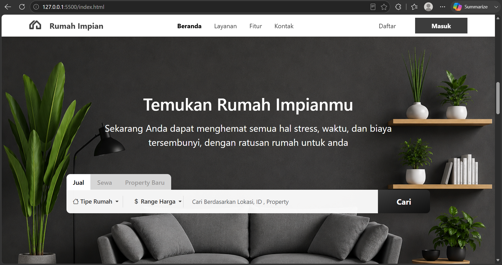
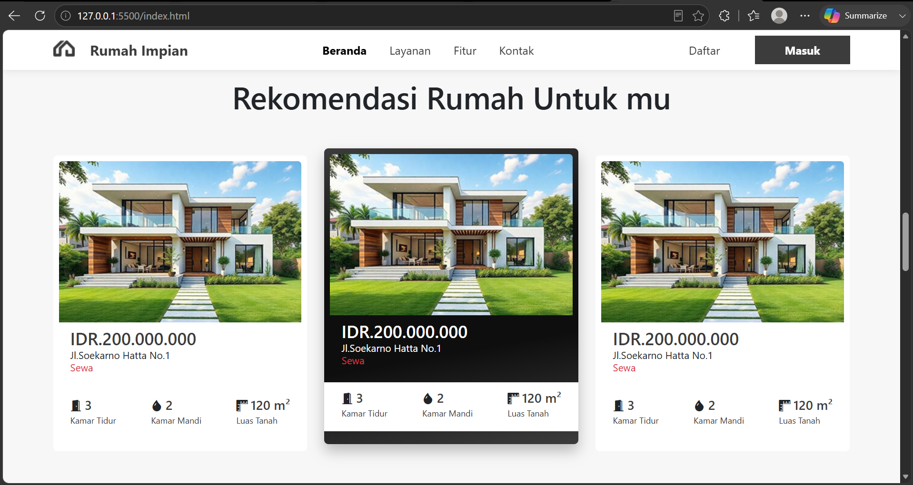
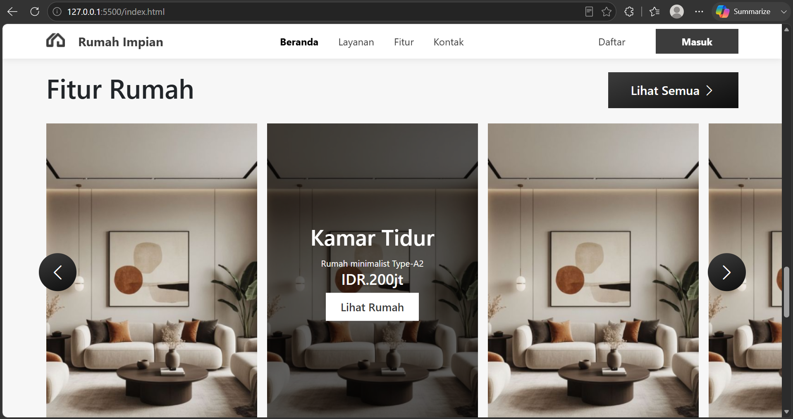
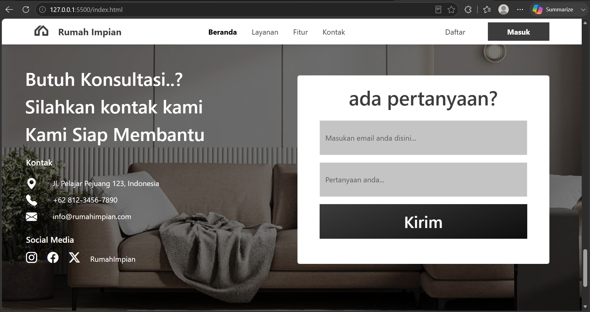

readme_content = """# 🏠 Rumah Impian - Marketplace Properti

> Website properti **statis → fullstack** dengan sistem booking dan pembayaran Midtrans (mode uji coba/Sandbox).

---

## 📸 Lampiran Gambar Web

| No | Halaman / Fitur | Gambar |
|----|-----------------|--------|
| 1 | **** | Halaman Awal (Hero Section) - Tampilan pertama website dengan navbar transparan dan tombol ajakan (CTA) |
| 2 | **** | Bagian Layanan - 3 kartu layanan (Properti Baru, Sewa Rumah, Beli Rumah) dengan ikon lingkaran |
| 4 | **** | Bagian Pencarian - Form pencarian rumah dengan tab Jual / Sewa / Properti Baru |
| 5 | **** | Bagian Rekomendasi - Grid kartu rumah dengan harga, lokasi, dan fasilitas |
| 6 | **** | Bagian Fitur - Scroll horizontal kartu fitur rumah dengan overlay informasi |
| 7 | **** | Bagian Kontak - Form pertanyaan dan informasi kontak (alamat, telepon, email) |

---

## 🚀 Teknologi yang Dipakai

| Bagian | Teknologi |
|--------|-----------|
| **Tampilan (Frontend)** | HTML5, CSS3, Bootstrap 5.3, JavaScript biasa |
| **Server (Backend)** | Node.js, Express.js |
| **Database** | SQLite3 (file-based, tanpa server database terpisah) |
| **Pembayaran** | Midtrans Snap API (Mode Uji Coba/Sandbox) |
| **Ikon** | Bootstrap Icons |
| **Font** | Google Fonts (Inter, Poppins, Nunito) |

---

## 📁 Struktur Folder Project

```
rumah-impian/
│
├── 📂 asset/                          # File gambar, logo, ikon
│   ├── aksen.png                      # Gambar hiasan di hero
│   ├── background.png                 # Background bagian pencarian
│   ├── bg-contact.png                 # Background bagian kontak
│   ├── fitur1.png                     # Gambar fitur rumah
│   ├── gambar1.png                    # Gambar rumah (thumbnail)
│   ├── logo-hitam.png                 # Logo warna hitam (saat navbar putih)
│   ├── logo-putih.png                 # Logo warna putih (saat navbar transparan)
│   ├── rumah.png                      # Gambar rumah di hero section
│   └── vector-hitam.svg               # Ikon favicon hitam
│
├── 📂 style/                          # File CSS
│   ├── style.css                      # Gaya utama (warna, font, layout)
│   └── responsive.css                 # Gaya responsif (HP, tablet, desktop)
│
├── 📂 js/                             # File JavaScript di sisi pengguna
│   └── main.js                        # Ambil data rumah, form booking, integrasi Midtrans
│
├── 📄 index.html                      # Halaman utama website
│
└── 📂 server/                         # Folder server (Node.js)
    ├── 📄 server.js                   # Titik masuk Express
    ├── 📄 database.js                 # Setup SQLite dan data awal
    ├── 📄 .env                        # Variabel rahasia (API key, jangan dishare!)
    ├── 📄 package.json                # Daftar library Node.js
    ├── 📄 database.sqlite             # File database (terbuat otomatis)
    │
    └── 📂 routes/                     # Rute API
        ├── houses.js                  # API daftar rumah (GET)
        ├── orders.js                  # API pemesanan + token Midtrans (POST)
        └── webhook.js                 # API notifikasi bayar dari Midtrans
```

---

## ⚙️ Cara Install dan Menjalankan

### 1. Masuk ke Folder Project

```bash
cd "C:\\company profil"
```

### 2. Install Library Backend

```bash
cd server
npm install
```

### 3. Buat File Konfigurasi `.env`

Buat file baru di `server/.env`, isi seperti ini:

```env
PORT=3000
MIDTRANS_SERVER_KEY=SB-Mid-server-xxxxxxxxxx
MIDTRANS_CLIENT_KEY=SB-Mid-client-xxxxxxxxxx
MIDTRANS_IS_PRODUCTION=false
```

> **Cara dapat API Key Midtrans:**
> 1. Buka https://dashboard.sandbox.midtrans.com
> 2. Daftar atau masuk akun
> 3. Pergi ke menu **Pengaturan → Access Keys**
> 4. Salin **Server Key** dan **Client Key**

### 4. Update Client Key di File HTML

Buka `index.html`, cari bagian `<head>`, ganti `data-client-key`:

```html
<script src="https://app.sandbox.midtrans.com/snap/snap.js" data-client-key="SB-Mid-client-xxxxxxxxxx"></script>
```

### 5. Nyalakan Server

```bash
# Pastikan berada di folder server/
npm run dev
```

Server nyala di: **http://localhost:3000**

### 6. Buka di Browser

```
http://localhost:3000/index.html
```

---

## 🔌 Daftar API (Endpoint)

| Cara Akses | Alamat | Kegunaan |
|------------|--------|----------|
| `GET` | `/api/health` | Cek server hidup atau tidak |
| `GET` | `/api/houses` | Ambil semua rumah (bisa filter: `?type=jual&location=jakarta`) |
| `GET` | `/api/houses/:id` | Ambil detail satu rumah |
| `POST` | `/api/orders/create` | Buat pesanan baru + dapat token Midtrans |
| `GET` | `/api/orders` | Lihat semua pesanan |
| `GET` | `/api/orders/:orderId` | Cek status satu pesanan |
| `POST` | `/api/webhook` | Midtrans kirim notifikasi status bayar |

---

## 💳 Kartu Uji Coba Midtrans (Dummy)

| Kejadian | Nomor Kartu | CVV | Masa Berlaku | OTP |
|----------|-------------|-----|--------------|-----|
| ✅ **Berhasil** | `4811 1111 1111 1114` | `123` | `01/25` | `112233` |
| ❌ **Gagal** | `4911 1111 1111 1113` | `123` | `01/25` | - |
| ⏳ **Tantangan** | `4511 1111 1111 1117` | `123` | `01/25` | `112233` |

### Alur Pembayaran Uji Coba

```
1. Pengguna klik "Booking Sekarang" di kartu rumah
        ↓
2. Isi form (Nama, Email, Telepon) → Klik Submit
        ↓
3. Server buat token Snap via API Midtrans
        ↓
4. Muncul popup Midtrans → Pilih "Kartu Kredit"
        ↓
5. Masukkan nomor kartu uji coba → Klik "Bayar Sekarang"
        ↓
6. Masukkan OTP 112233 → Klik Konfirmasi
        ↓
7. Pembayaran sukses → Webhook update status jadi "paid"
        ↓
8. Status rumah otomatis berubah jadi "terbooking"
```

---

## 🏗️ Skema Database (SQLite)

### Tabel `houses` (Data Rumah)

| Nama Kolom | Tipe Data | Keterangan |
|------------|-----------|------------|
| `id` | INTEGER (Primary Key) | Nomor urut otomatis |
| `title` | TEXT | Nama rumah |
| `price` | INTEGER | Harga dalam Rupiah |
| `type` | TEXT | Jenis: `jual` atau `sewa` |
| `location` | TEXT | Alamat lokasi |
| `image` | TEXT | Lokasi file gambar |
| `bedrooms` | INTEGER | Jumlah kamar tidur |
| `bathrooms` | INTEGER | Jumlah kamar mandi |
| `area` | INTEGER | Luas tanah (m²) |
| `status` | TEXT | Ketersediaan: `available` / `booked` / `sold` |
| `description` | TEXT | Penjelasan rumah |
| `created_at` | DATETIME | Waktu data dibuat |

### Tabel `orders` (Data Pemesanan)

| Nama Kolom | Tipe Data | Keterangan |
|------------|-----------|------------|
| `id` | INTEGER (Primary Key) | Nomor urut otomatis |
| `order_id` | TEXT (Unik) | Format: `ORDER-{timestamp}-{random}` |
| `house_id` | INTEGER (Foreign Key) | Tautan ke tabel houses |
| `customer_name` | TEXT | Nama pembeli |
| `customer_email` | TEXT | Email pembeli |
| `customer_phone` | TEXT | Nomor telepon |
| `amount` | INTEGER | Total yang harus dibayar |
| `status` | TEXT | Status: `pending` / `paid` / `failed` / `expired` |
| `payment_type` | TEXT | Cara bayar (credit_card, gopay, dll) |
| `snap_token` | TEXT | Token dari Midtrans |
| `midtrans_transaction_id` | TEXT | ID transaksi di Midtrans |
| `created_at` | DATETIME | Waktu pesanan dibuat |
| `paid_at` | DATETIME | Waktu pembayaran lunas |

---

## 🎨 Fitur Website

### Bagian Tampilan (Frontend)
- ✅ **Navbar Transparan → Putih** saat halaman di-scroll ke bawah
- ✅ **Ganti Logo** (putih ↔ hitam) mengikuti warna navbar
- ✅ **Bagian Hero** dengan latar gradasi gelap dan gambar rumah
- ✅ **Bagian Layanan** 3 kartu dengan ikon lingkaran dan efek hover
- ✅ **Bagian Pencarian** form dengan tab Jual / Sewa / Properti Baru
- ✅ **Bagian Rekomendasi** kartu rumah ambil data dari database secara dinamis
- ✅ **Bagian Fitur** scroll horizontal dengan overlay informasi
- ✅ **Bagian Kontak** form pertanyaan dan info kontak lengkap
- ✅ **Bagian Bawah** footer dengan logo dan menu
- ✅ **Desain Responsif** untuk HP, tablet, dan desktop

### Bagian Server (Backend)
- ✅ **API REST** pakai Express.js
- ✅ **Database SQLite** (file-based, ringan, tanpa setup rumit)
- ✅ **Integrasi Midtrans** (Snap API untuk popup pembayaran)
- ✅ **Webhook Handler** update status otomatis setelah bayar
- ✅ **Verifikasi Tanda Tangan** (signature) untuk keamanan webhook

---

## 🔧 Cara Admin Menambah Rumah (Manual)

Karena tidak ada halaman admin, admin menambah rumah secara manual:

### Cara 1: Pakai DB Browser for SQLite (Paling Mudah)
1. Download [DB Browser for SQLite](https://sqlitebrowser.org/)
2. Buka file `server/database.sqlite`
3. Pilih tab **Browse Data** → pilih tabel `houses`
4. Klik tombol **New Record** → Isi data rumah
5. Klik **Write Changes** (Ctrl+S)

### Cara 2: Pakai API (Postman / curl)

```bash
curl -X POST http://localhost:3000/api/houses \
  -H "Content-Type: application/json" \
  -d '{
    "title": "Rumah Baru",
    "price": 300000000,
    "type": "jual",
    "location": "Jl. Baru No.1, Jakarta",
    "image": "../asset/gambar1.png",
    "bedrooms": 3,
    "bathrooms": 2,
    "area": 150,
    "description": "Deskripsi rumah baru"
  }'
```

### Cara 3: Edit File `database.js`

Tambahkan data di array `dummyHouses` di file `server/database.js`, lalu:
1. Hapus file `database.sqlite`
2. Restart server (`npm run dev`)
3. Database baru akan terbuat dengan data yang sudah ditambah

---

## 🐛 Solusi Masalah (Troubleshooting)

| Masalah | Penyebab | Solusi |
|---------|----------|--------|
| `Cannot find module './routes/orders'` | Folder `routes` atau file `orders.js` belum ada | Buat folder `server/routes/` dan file `orders.js` |
| `Error: Cannot find module 'express'` | Library belum di-install | Jalankan `npm install` di folder `server/` |
| `MIDTRANS_SERVER_KEY is required` | File `.env` belum dibuat atau key kosong | Buat file `.env` dan isi API key dari dashboard Midtrans |
| `snap is not defined` | Script Midtrans belum dimuat di HTML | Pastikan tag `<script src="...snap.js">` ada di `<head>` |
| `CORS error` di console browser | Server tidak izinkan akses dari browser | Pastikan `app.use(cors())` ada di `server.js` |
| Status bayar tidak update di database | Webhook tidak bisa dijangkau Midtrans | Gunakan **ngrok** untuk buat URL publik dari localhost |

### Cara Pakai ngrok (Untuk Webhook Lokal)

```bash
# Install ngrok dulu di https://ngrok.com/
# Buka terminal baru, jalankan:
ngrok http 3000

# Akan muncul URL seperti: https://abcd-123-45.ngrok-free.app
# Copy URL tersebut, tambahkan `/api/webhook`
# Contoh: https://abcd-123-45.ngrok-free.app/api/webhook

# Masuk ke Dashboard Midtrans → Settings → Payment Notification
# Paste URL webhook di situ
# Sekarang Midtrans bisa kirim notifikasi ke komputer lokalmu
```

---

## 📌 Catatan Penting

- ⚠️ **Mode Uji Coba (Sandbox)**: Website ini pakai Midtrans Sandbox (bukan asli). Untuk jadi nyata, ubah `MIDTRANS_IS_PRODUCTION=true` dan ganti API key ke mode Production.
- ⚠️ **File `.env` Jangan Dishare!** Jangan upload ke GitHub atau kirim ke orang lain. Isinya berisi rahasia API key.
- ⚠️ **Database SQLite**: File `database.sqlite` akan terbuat otomatis saat server pertama kali nyala. Jangan hapus kecuali mau reset semua data.
- ⚠️ **Gambar Rumah**: Semua gambar pakai `gambar1.png` sebagai contoh. Ganti dengan gambar asli di folder `asset/` dan update path di database.

---

## 📄 Hak Cipta

&copy; 2026 Rumah Impian. Hak Cipta Dilindungi.

---

## 👨‍💻 Pembuat

Dibuat dengan ❤️ untuk belajar membuat website fullstack dari nol.

**Teknologi**: HTML + CSS + Bootstrap + Node.js + Express + SQLite + Midtrans
"""

# Save to file
with open('/mnt/agents/output/README.md', 'w', encoding='utf-8') as f:
    f.write(readme_content)

print("✅ README.md berhasil dibuat dalam Bahasa Indonesia!")
print(f"📄 Total karakter: {len(readme_content)}")
